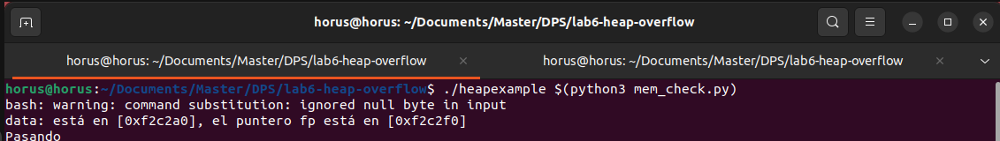

# lab6-heap-overflow
### Versión del sistema
Distributor ID:	Ubuntu
Description:	Ubuntu 22.04.5 LTS
Release:	22.04
Codename:	jammy

### Versión de GDB
GNU gdb (Ubuntu 12.1-0ubuntu1~22.04.2) 12.1

### Versión python3
Python 3.10.12

## Resultado
Como se puede ver, al ejecutar el programa con el argumento devuelto por `mem_check.py` salta a la función `f_entrar` que es quien imprime *Pasando*:

