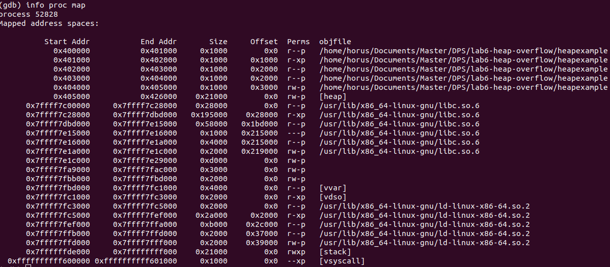
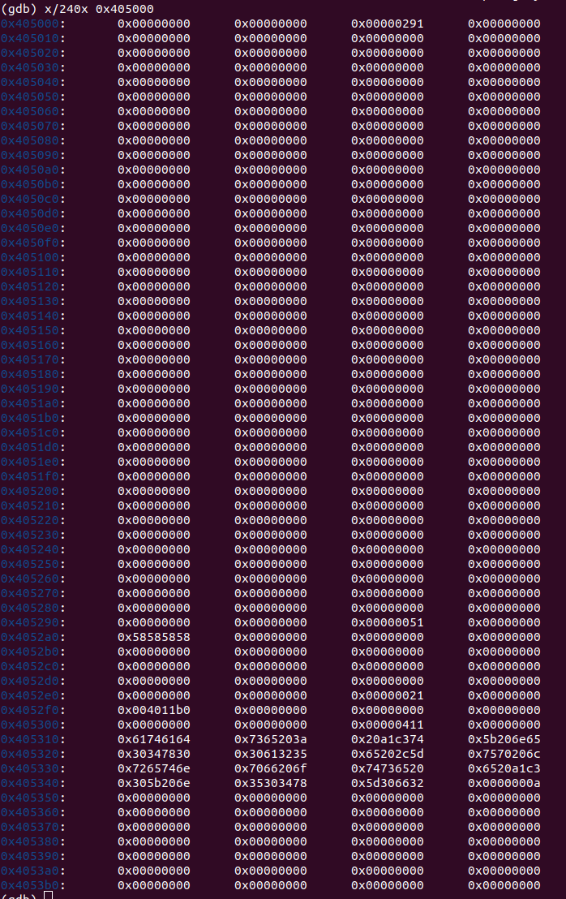
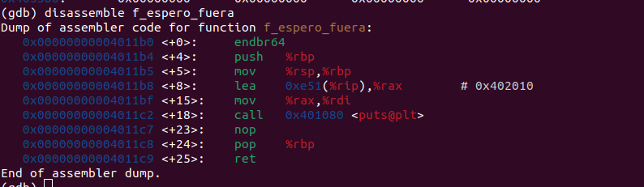
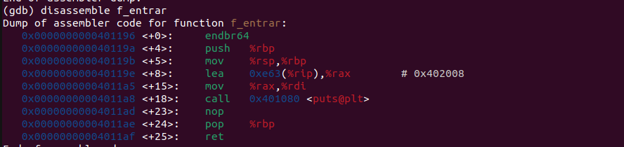
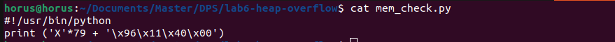
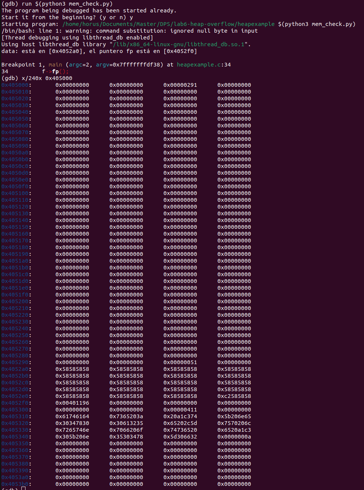

# lab6-heap-overflow
### Versión del sistema
Distributor ID:	Ubuntu
Description:	Ubuntu 22.04.5 LTS
Release:	22.04
Codename:	jammy

### Versión de GDB
GNU gdb (Ubuntu 12.1-0ubuntu1~22.04.2) 12.1

### Versión python3
Python 3.10.12

## Proceso
### Paso 1
Lo primero que tengo que hacer es ubicar en la memoria del heap el lugar donde se alamcena el buffer. Para eso con `GDB` pongo un *breakpoint* justo antes de la llamada a la función desde el puntero `f`, y ejecuto el programa con una entrada reconocible como puede ser *XXXX* que en hexadecimal debe aparecer como *58585858*. Pero antes necesito buscar la dirección de memoria desde la que empiza el **heap** que es 0x405000 en mi caso:

Muestro 240 bytes desde dicha posición con formato hexadecimal y observo que el buffer `s_midata` tiene como dirección de inicio `0x4052a0`:

### Paso 2
Ahora encesito encontrar en que dirección del heap se encuentra almacenada la dirección de la función `f_espero_fuera`,  es decir, encontrar la dirección del puntero `f` en el heap. Para ello debo conocer la dirección de dicha función, para ello GDP nos permite desensamblar funciones y ver las posiciones de cada instrucción, en este caso es *0x00000000004011b0*:

Mirando dentro del heap (Ver figura anterior) veo que en la dirección *0x4052f0* está almacenada la dirección de esta función. De esta forma calculo que 80 bytes separan ambos punteros.

### Paso 3
Para provocar y aprovechar el desbordaminto, creo un script en python `mem_check.py` que genere una cadena de 80 bytes, representados por una *X* y acuntinuación introduzca la dirección del `f_entrar` del revés por ser *little endian*. En realidad, no son 80 *X* sino 79, esto es porque se añade un byte con valor *c2* a continuación de la última *X*.

La dirección de `f_entrar` es *0x0000000000401196*:
 

Script `mem_check.py`:
    

Si ejecuto el programa con este argumento observo como se rellenan todas los bytes entre el buffer y el puntero a la función con *X* y se añade la dirección de memoria de `f_entrar` en el lugar deseado:
    

## Resultado
Como se puede ver, al ejecutar el programa con el argumento devuelto por `mem_check.py` salta a la función `f_entrar` que es quien imprime *Pasando*:

